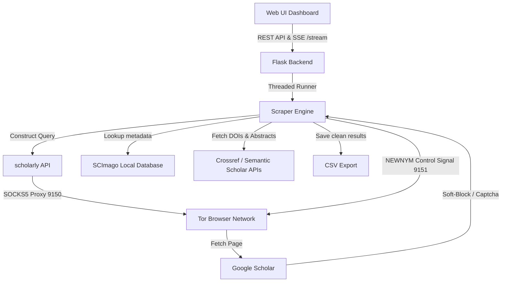

# Google Scholar Scraper & Quality Filtering Dashboard (v1.0.2)

An enterprise-grade, web-based dashboard and automation engine to search, scrape, and filter Google Scholar articles. It features robust integration with the **Tor Network** for self-healing SOCKS5 proxy rotation, automatically bypassing Google's anti-bot blocks and pagination limits.

## 🚀 Key Features

*   **Automated PDF Downloader Pipeline**: Downloads PDFs in 2 stages:
    *   **Direct Google Scholar Links**: Sourced directly from `eprint_url` if indexed.
    *   **Sci-Hub Fallback**: Automatically queries the `sci-hub.sidesgame.com` mirror using DOIs to scrape and download the PDF.
*   **Query-Specific Run Directories**: Automatically structures output runs into `Data Folder/scrape_{query}_{timestamp}/` containing the CSV file and all downloaded PDF files.
*   **Safe Filename Sanitization**: Automatically renames downloaded PDFs using cleaned paper titles. All special symbols (`.`, `-`, `:`, `/`, etc.) are stripped and replaced with underscores (`_`) to ensure perfect OS compatibility.
*   **Hybrid Links Layout**: The preview page links column renders only the `PAGE` button and a toggle: either the green `PDF` button (if downloaded successfully) or a grey `RG SEARCH` button (pointing to a Google search on ResearchGate for manual human verification and 1-click download).
*   **Advanced Query Builder**: Build complex boolean queries (supporting `MUST`, `AND`, `OR` operators) directly from the visual interface.

---

## 🛠️ System Architecture



---

## 📋 Installation & Setup

### Prerequisites
1.  **Python 3.10+** (Ensure it is added to your environment `PATH`).
2.  **Tor Browser**: Must be installed and running in the background to handle proxy routing and circuit rotation.

### Installation Steps

1.  **Clone the repository** (or navigate to the project directory):
    ```bash
    cd "Google Scholar Data"
    ```

2.  **Verify or set up the Virtual Environment**:
    If not already done, create a virtual environment:
    ```bash
    python -m venv .venv
    ```

3.  **Install Locked Dependencies**:
    Install all required packages precisely using the pinned `requirements.txt`:
    ```bash
    .\.venv\Scripts\pip install -r requirements.txt
    ```

---

## 🚦 How to Run

1.  **Launch Tor Browser**:
    *   Open the Tor Browser on your system.
    *   Keep it running in the background. (This opens the SOCKS5 proxy on port `9150` and the control port on `9151`).

2.  **Start the Scraper Dashboard**:
    Double-click the **`Start Scraper.bat`** file in the root directory. This script will:
    *   Kill any ghost servers on port `5000`.
    *   Start the Flask backend in a minimized background window.
    *   Automatically launch `http://127.0.0.1:5000` in your default browser.

3.  **Configure and Run**:
    *   Enter your search keywords in the configuration panel.
    *   Set results limits, year ranges, or quality criteria.
    *   Click **▶ RUN**. Watch the live terminal extract and verify papers in real-time.

---

## 📁 Repository Structure

*   `Code File/` - Contains the Flask backend and core scraping scripts:
    *   [app.py](file:///d:/Website/Life%20OS/Oppurtunity/Google%20Scholar%20Data/Code%20File/app.py) - Web server routes, SSE streaming handler, and UI controls.
    *   [scholar_scraper.py](file:///d:/Website/Life%20OS/Oppurtunity/Google%20Scholar%20Data/Code%20File/scholar_scraper.py) - Core scraping logic, SCImago database matching, Tor IP rotation, and Crossref API metadata pipeline.
    *   `templates/` - Frontend views ([index.html](file:///d:/Website/Life%20OS/Oppurtunity/Google%20Scholar%20Data/Code%20File/templates/index.html) and [data_view.html](file:///d:/Website/Life%20OS/Oppurtunity/Google%20Scholar%20Data/Code%20File/templates/data_view.html)).
    *   `static/` - UI CSS styles and client-side JavaScript controllers.
*   `Data Folder/` - Stores all downloaded and scraped CSV output results.
*   `Assets/` - Local JSON metadata lists (e.g. `scimagojr_2025.json`).
*   `requirements.txt` - Python package pin definitions ensuring system compatibility.
*   `Start Scraper.bat` - Windows launcher script.
